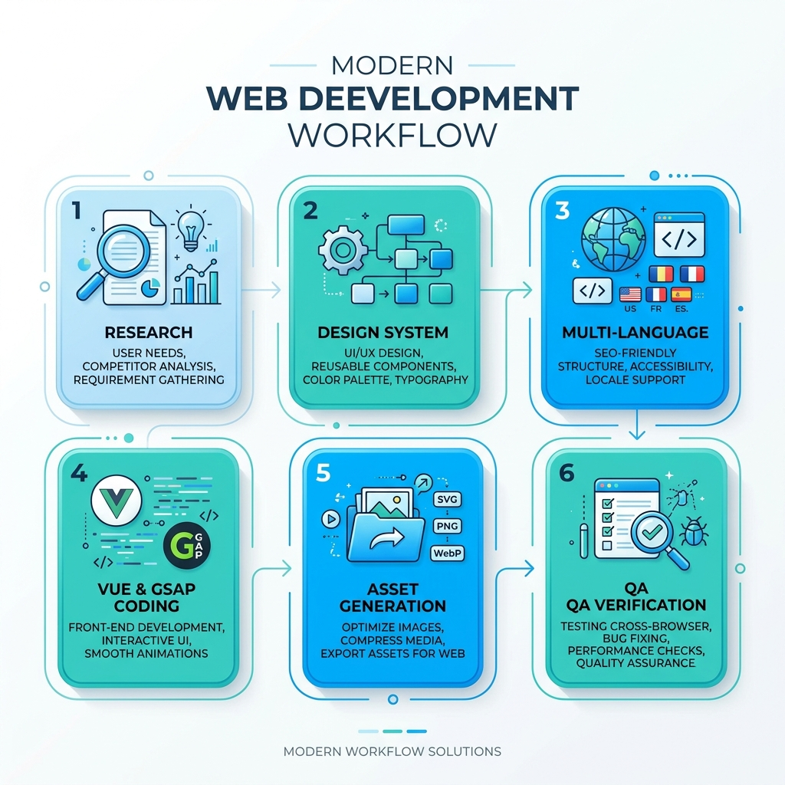

# James Sun's Personal Homepage | 個人網頁

A premium, interactive, clean and bright personal website for James Sun. Fully responsive and styled with modern typography, glassmorphism clock, dual-language support, and smooth GSAP animations.

🌐 **Live Demo / 線上展示**: [https://jamessun0919-ops.github.io/HW2MyHomepage/](https://jamessun0919-ops.github.io/HW2MyHomepage/)

---

## 🎯 Project Goal | 專案目標

Build a bright, clean, dual-language (English / Traditional Chinese) personal homepage for James Sun, featuring smooth GSAP scroll animations and a live glassmorphic digital clock, modeled after `https://quantumwings.github.io/`.

以清晰明亮、雙語（中／英）呈現的方式，為 James Sun 打造個人首頁，具備 GSAP 動態滾動效果與玻璃擬物化即時時鐘，並以 `https://quantumwings.github.io/` 為設計範本。

---

## 🏗️ Architecture | 計畫架構

- **Frontend**: Vue 3 (CDN) for reactive state, GSAP + ScrollTrigger for animations, Font Awesome icons.
- **Pages**: `index.html` / `index-zh.html` (home), `prog-projects*.html`, `ai-projects*.html`, `python-work-platform.html` — each with a paired EN/ZH version.
- **Assets**: `style.css` (design system), `app.js` (clock logic, animations, language switching), `img/` (hero background + category SVGs).

---

## 🎨 Visual Preview & Workflow Infographic | 開發流程圖



---

## ✅ Completed Progress | 已完成進度

### 1. Spec Research & Requirements Analysis (範本研究與需求分析)
- Investigated template structure (`https://quantumwings.github.io/`).
- Identified key technology stack: Vue 3 (CDN), GSAP & ScrollTrigger, and Montserrat + Cormorant Garamond fonts.

### 2. Implementation Planning (實作計劃)
- Defined a sleek bright design palette (Slate-900 `#0f172a`, Slate-50 `#f8fafc`, Sky-600 `#0284c7`).
- Structured a custom Glassmorphic digital clock with ticking animations and local date formatting.

### 3. Styling & Base CSS Setup (設計系統建置)
- Implemented `style.css` containing variables, layout resets, animations, responsive grids, and navigation interactions.

### 4. HTML Page Coding (中英文網頁建構)
- Created English `index.html` and Traditional Chinese `index-zh.html`.
- Structured standard semantic blocks: Navigation Header, Hero, About, Gallery (Portfolio), and Contact.

### 5. App Core & GSAP Scripting (邏輯與動畫實作)
- Wrote `app.js` integrating Vue 3 for reactive live clock updates and language switching.
- Integrated GSAP ScrollTrigger timeline for layout loading and card fade-ins.

### 6. Assets Design & Production (視覺與向量資源生成)
- Generated AI hero background image `hero_bg.jpg`.
- Compiled and exported 8 beautiful custom-designed category vector SVGs to `img/`.

### 7. Automated browser Testing (測試驗證)
- Conducted browser subagent verification checks on the live clock, layout alignment, language switcher transitions, and responsive widths.

---

## 📌 Next Steps | 未完成事項

- No open items currently tracked. Update this section when new work is planned or in progress.
- 目前沒有記錄中的未完成事項，如有新的待辦項目請於此處更新。

---

## 📂 File Directory | 檔案架構

- 📄 `index.html` - Core English HTML layout.
- 📄 `index-zh.html` - Core Traditional Chinese HTML layout.
- 📄 `style.css` - UI Design System stylesheet.
- 📄 `app.js` - Vue 3 reactivity & GSAP animations logic.
- 📄 `workflow_infographic.png` - Visual workflow infographic.
- 📄 `today_workflow.md` - Chronological development log.
- 📁 `img/` - Image directories (Hero background & 8 customized SVG focus icons).

---

## 🚀 How to Run Locally | 本地運行

1. Clone this repository:
   ```bash
   git clone https://github.com/jamessun0919-ops/HW2MyHomepage.git
   ```
2. Navigate to the directory and open `index.html` directly in any web browser of your choice.

---

## 📝 Webpage Modification & Deployment Rules | 網頁修改與部署規則

To maintain bilingual consistency and ensure that the live presentation is always up-to-date, all future modifications must follow these rules:

1. **Synchronous Modification of EN/ZH Pages | 同步修改中英文版網頁**:
   - Any layout, text, script, or style updates made to the Chinese version (`*-zh.html`) must be applied correspondingly to the English version (`*.html`), and vice versa, to ensure bilingual parity.
2. **Synchronous Deployment to GitHub | 同步部署至 GitHub**:
   - All approved modifications must be immediately committed and pushed to the remote GitHub repository:
     [https://github.com/jamessun0919-ops/HW2MyHomepage](https://github.com/jamessun0919-ops/HW2MyHomepage)
     This triggers the deployment of the updated live website.
